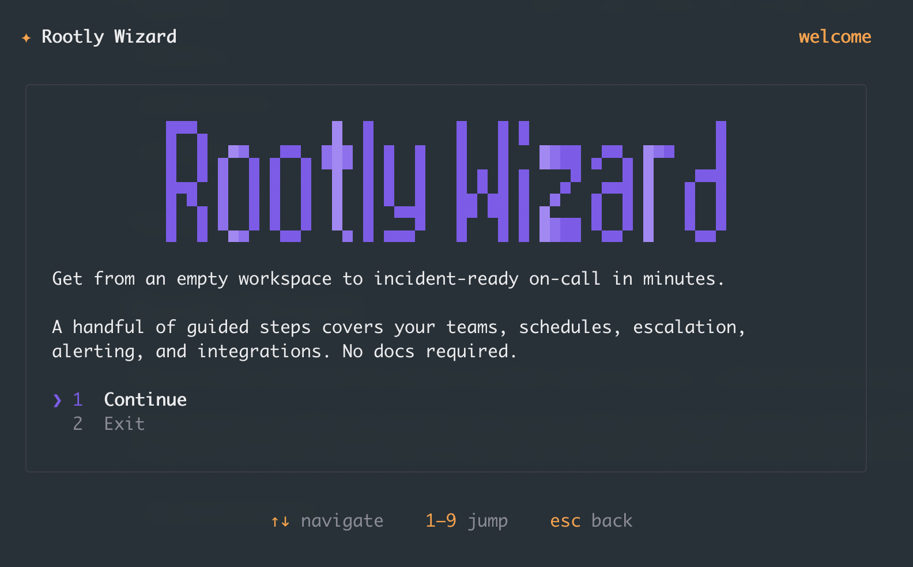

# Rootly Wizard

Get your Rootly workspace from empty to incident-ready in minutes — without clicking through every setup screen.

Rootly Wizard is a guided command-line setup tool. It walks you through creating a team, putting people on call, wiring up escalation and alerting, creating a status page, and firing a real test alert and incident — including a phone call to whoever is on call — so you can see the whole flow end to end.



```bash
npx @rootly/wizard
```

## Requirements

- **Node.js 18 or newer**
- A **Rootly account** (don't have one? the wizard can hand you off to sign up)
- Sign in with a **browser (OAuth)** or a **Rootly API token** (see [Signing in](#signing-in))
- A terminal (macOS, Linux, or Windows)

## Quick start

Run the wizard:

```bash
npx @rootly/wizard
```

Sign in (browser or API token — your session is stored securely in your OS keychain), then land on the main menu:

- **Recommended setup** — set everything up at once and see a test alert (that pages on-call) + a test incident
- **General setup** — pick any individual task (teams, on-call, status pages, integrations, and more)

Your sign-in is remembered, so the next run takes you straight to the menu.

## Signing in

From the sign-in screen you can:

- **Browser sign-in** — authorize in your browser (OAuth).
- **API token** — paste a Rootly API token. **Recommended for the full experience** (see [Known limitations](#known-limitations)).
- **Create a Rootly account** — opens signup in your browser. Account creation is web-only (it's protected by a CAPTCHA), so the wizard hands off to the website, then you return and sign in.

To create an **API token**:

1. Log in to Rootly.
2. Go to **Organization Settings → API Keys**.
3. Click **Generate New API Key**, name it, and copy the token.

**Which key type?** Use a **Global** key with write access (teams, schedules, escalation, alerts, incidents) so the wizard can complete setup, or a **Personal** key if your account can already manage those.

Docs: <https://docs.rootly.com/api-reference/overview>

Your token/session is stored in your operating system's keychain. You can also provide a token via the `ROOTLY_TOKEN` environment variable:

```bash
ROOTLY_TOKEN=rootly_xxx npx @rootly/wizard
```

On exit, the wizard asks whether to keep the saved sign-in or delete it from your keychain (it keeps it by default).

## What you can do

### Recommended setup (all-in-one)

The fastest path. In one flow it will:

1. Create a team (or reuse one you're already on)
2. Let you pick who joins the team and the on-call rotation
3. Create an on-call schedule
4. Create an escalation policy that pages the on-call schedule
5. Add an alert source
6. Create an internal status page
7. Fire a **test alert** that **pages the on-call person** (a real call/text)
8. Open a **test incident** (with a link to its Slack channel, if Slack is connected)

Before it runs, you can add and verify a **phone number** and connect **Slack** so the test alert actually reaches you. Anything that already exists is reused, so it's safe to re-run.

### General setup

Jump to any individual task:

- **Teams & members** — create teams, add members from your directory
- **On-call** — schedules and escalation policies
- **Status page** — create an internal status page
- **Integrations** — Slack, and alert-source handoffs (Datadog, Grafana, Sentry, PagerDuty, Opsgenie)
- **Verify** — send a test alert (pages on-call) or create a test incident
- **Inspect** — review your current teams, schedules, and coverage
- **MCP / IDE** — configure the Rootly MCP server for your editor or AI agent

### MCP / IDE setup

The wizard can write Rootly MCP server config for supported clients: **Cursor, Claude Code, Claude Desktop, Windsurf, and Codex**.

## Scripting (advanced)

Every setup step is also available non-interactively as a JSON-in/JSON-out action — handy for automation or AI agents:

```bash
rootly-wizard action list                 # list available actions
rootly-wizard action describe <name>      # show an action's inputs
rootly-wizard action get-recommended-next-step
rootly-wizard action one-shot-setup '{"teamName":"Payments"}'
```

Add `"dryRun": true` to any setup action to preview it without making changes.

## Known limitations

The wizard is under active development. A few things to know:

- **Use an API token for the full experience.** Browser (OAuth) sign-in can create teams, schedules, escalation policies, alert sources, status pages, alerts, and incidents — but it currently can't list your user directory, so **picking other teammates falls back to just you** (a server-side fix is in progress). An API token has no such limit.
- **Account creation is browser-only** (CAPTCHA / spam protection), so the wizard hands off to the website for signup.
- **Clickable links and the logo art** depend on your terminal's capabilities; where they aren't supported, the wizard falls back to plain text.

## Troubleshooting

- **"Sign in to Rootly" keeps appearing** — your token may be missing or invalid. Generate a fresh key (Organization Settings → API Keys) and re-enter it, or sign in with your browser.
- **Setup steps are skipped or blocked** — the sign-in needs write access. Use a Global API token with the relevant permissions, or see [Known limitations](#known-limitations).
- **Nothing happens / wrong screen** — make sure you're on Node.js 18+ and running in an interactive terminal.

## Development

From a clone of this repo:

```bash
node ./src/cli.js     # run the wizard locally
npm test              # run the test suite
```

(Use `node ./src/cli.js` rather than `npm start` for demos — `npm start` echoes the underlying command before launching.)
